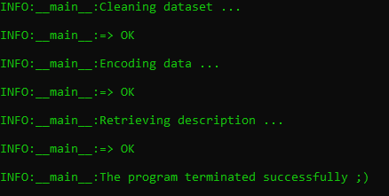

# ObfuscateCommands

Program written by Dany Giang aka CyberMatters.

## Overview

SOC and CERT analysts usually have a list of plaintext malicious commands that they want to detect or quickly find during forensic analysis.
However, attackers often obfuscate their commands in order to evade classic detection rules based on plaintext commands.

ObfuscateCommands is useful when you have a list of plain text commands (or any strings) and wish to obtain their equivalent in different encoding type.

At this stage, the encoding type are:

* base64
* ascii
* hex
* rot 1, rot 2, ... , rot 25

## INPUTS

The script requires :

* 2 CSV input files which paths will be specified in command line.
  * The input file must contain at least 2 columns/fields which names are "command", "description" but I suggest to add as well "FE" for Feared Event and "TTP"
  * The string specified in the column "command" must be surrounded by wildcards (*) `*evil.exe -encrypt*`
  * No wildcard is allowed in the middle of the command, for instance `*evil.exe * file.txt*`
  * The command itself must contain at least 5 characters.

:warning: The script will silently remove all commands that do not meet the requirements above.

Below is an example of usage :

`py encode_string.py -i "C:\Users\dgg\Documents\SOC\tools\plaintext_commands_list.csv" -o "C:\Users\dgg\Documents\SOC\tools\obfuscated_commands_list.csv"`

## OUTPUT

If the script completes successfully you should see this in your terminal :

Finally, the CSV file that you have specified will also be filled with the obfuscated commands.

